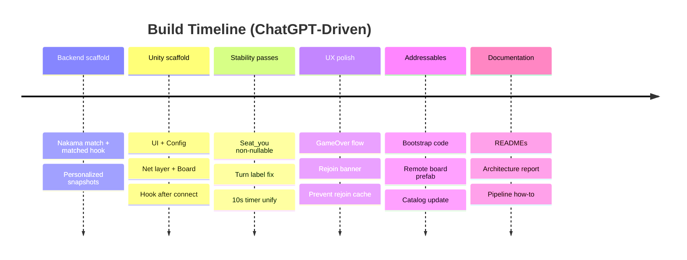

# How We Built It With ChatGPT — Process Report

## Abstract

This document recounts **how the project was planned and produced using ChatGPT** from the very first prompts to a working Unity + Nakama multiplayer prototype, along with supporting documentation and diagrams. It focuses on **prompt design, iteration loops, decision points, and troubleshooting**—so others can reproduce the process.

---

## 1) Project goal & constraints

* **Goal:** Ship a minimal but robust **server‑authoritative Tic‑Tac‑Toe** playable on Android, with matchmaking, timers, rejoin, and remote Addressables.
* **Constraints:**

  * Use **Nakama (Go runtime)** for backend authority.
  * Use **Unity** for the client with **Addressables**.
  * Keep matchmaking **batched at 10s cadence**; enforce **10s turn deadline**.
  * Produce academic‑style docs (README, architecture report, diagrams) as we go.

---

## 2) Prompting strategy (playbook)

We adopted a **scaffold → refine → verify** pattern:

1. **Scaffold:** Ask for high‑level components and file layout (no code yet) to check the architecture and naming.
2. **Generate:** Request focused code (e.g., *“give me all the UI code first”*), keeping scope bounded.
3. **Integrate:** Paste snippets into the project; run; report errors or gaps verbatim.
4. **Refine:** Ask for targeted fixes (e.g., *“socket init is wrong, use client.NewSocket(useMainThread:true)”*).
5. **Verify:** Add logs/diagnostics; confirm messages and flows.
6. **Document:** Once stable, generate READMEs, architecture sections, and diagrams.

> **Guideline we followed:** Make each prompt **specific, single‑purpose, and testable**. Provide context (what’s already implemented) and the exact error/behavior.

---

## 3) Chronology of key interactions (what we asked, what we got)

### Phase A — Backend bootstrap (Nakama Go)

* **Prompt:** *“Give me a Tic‑Tac‑Toe match in Nakama using Go runtime; I just want the match scripts, not a full project.”*
* **Outcome:** Server match skeleton with join/loop/move handlers; matchmaker matched hook registered.
* **Decision:** Deterministic seating (seat 0 = X, seat 1 = O); send **personalized snapshots** with `seat_you`.

### Phase B — Unity scaffolding

* **Prompt:** *“What classes and assets do I need for the Unity client? Portrait Android, connect UI, matchmaking, game board.”*
* **Outcome:** Class map (NakamaConnection, NakamaMatchmaking, NakamaMatchClient, TTTMatchController, BoardView, UI panels, GameConfigSO), plus scene hierarchy.
* **Follow‑ups:**

  * *“Give me all UI code first.”* → Panels & HUD.
  * *“Create the ScriptableObject config and how to use it.”* → Centralized constants.

### Phase C — Socket & subscription issues (critical fix)

* **Observation:** After joining, no state updates appeared; turn/timer never moved.
* **Prompt:** *“It’s broken: I get no states after join. What do you think?”*
* **Analysis/Fix:** We identified a **subscription bug**—handlers were attached to a **stale socket**. We rewired `HookSocket()` to run **after** the real socket connects and to **unhook** on disconnect.
* **Code change:** `client.NewSocket(useMainThread:true)` and re‑subscription on `OnConnected`.

### Phase D — API correctness (nullable + turn label)

* **Issue:** Turn label stuck at “Waiting for server…”.
* **Prompt:** *“turnLabel still is not working…”*
* **Fix:** Unity’s `JsonUtility` ignores `int?`. We **removed nullable** from `seat_you` and updated the turn computation. Timer set to **10 seconds** across client/server.

### Phase E — UX & flow polish

* **Prompts:**

  * *“Announce winner, return to matchmaking, prevent rejoin.”*
  * *“Make a rejoin banner that auto‑hides.”* (we used a simple coroutine; you opted for `StopAllCoroutines()` for brevity.)
* **Outcome:** Clean game‑over flow; rejoin cache cleared to avoid accidental re‑entry.

### Phase F — Remote content (Addressables)

* **Prompt:** *“Explain and add Addressables remote catalog flow with code from our bootstrap.”*
* **Outcome:** `AddressablesBootstrap` + README section; remote `GameBoard` prefab loaded by key (`GameBoard`).

### Phase G — Documentation & academic framing

* **Prompts:**

  * *“README for Nakama repo focusing on architecture; Docker compose one‑liner; add matchmaking cadence note.”*
  * *“Unity README; add a stronger Addressables section with the code we used.”*
  * *“Architecture report with 42010 viewpoints + Mermaid diagrams; alternatives table.”*
  * *“Rewrite Introduction; create a build pipeline how‑to.”*
* **Outcome:** A set of polished docs in Markdown with working Mermaid.

---

## 4) What changed because of feedback (turning points)

1. **Socket lifecycle:** Hooking events on the wrong socket instance → moved to *post‑connect* and added unhook on close.
2. **Per‑player state:** Personalized snapshot (`seat_you`) made the client deterministic; also used on game‑over.
3. **`JsonUtility` nuance:** Dropped nullable types to ensure fields populate; fixed turn label logic.
4. **Timer & cadence:** Unified **10s** timeout across client/server; documented **10s matchmaking cadence**.
5. **Rejoin UX:** Added banner with timeout; prevented rejoining finished matches by clearing the cache.
6. **Addressables flow:** Shifted to a practical bootstrap: initialize → check/update catalog → load by key.

---

## 5) Prompts that worked well (templates)

* **Isolated component ask:**

  > “Give me just the Unity **UI** code for Connect/Matchmaking/Game HUD (TMP + Buttons), public fields for wiring, no networking yet.”

* **Context + constraint:**

  > “Server runs at 5 Hz and uses a 10‑second per‑turn `deadline_tick`. Show how to compute ‘your turn’ from `seat_you` + `next` on the client.”

* **Bug triage:**

  > “After matchmaking join I get **no state messages**. Socket is created like this: … Show me where event subscriptions should happen.”

* **Doc framing:**

  > “Write a README that **explains the architecture** (42010 viewpoints), avoids low‑level code, and shows Docker ‘one command up’ using this Dockerfile: …”

* **DX guide:**

  > “Add a section for **remote Addressables** that explains exactly what **our** bootstrap does, with code snippets.”

---

## 6) Reproducible pipeline (checklist)

1. **Backend**: Register match + matchmaker hook; implement personalized snapshots; set `tickRate=5`, `turnTimeout=10s`.
2. **Docker**: Multi‑stage build `.so`, compose `up --build`.
3. **Client**: Build UI; `GameConfigSO`; **connect** → **subscribe after connect**; matchmaking; join; board input.
4. **State logic**: Use **non‑nullable** `seat_you`; compute `yourTurn` from `next`/`winner`.
5. **Game over**: Toast result; leave; clear rejoin cache; show matchmaking.
6. **Addressables**: Init → `CheckForCatalogUpdates()` → `UpdateCatalogs()` → `LoadAssetAsync(GameBoard)`.
7. **Docs**: Add 42010‑aligned report + deployment diagram; include alt‑architectures table.

---

## 7) Lessons learned

* **Order of operations matters:** Subscribe to the **live** socket instance—only after `ConnectAsync`.
* **Simplify client protocol:** Per‑player snapshots with `seat_you` remove guesswork and race conditions.
* **Unity JSON pitfalls:** Avoid nullable types with `JsonUtility`.
* **Small UX wins pay off:** Clear end‑of‑match and rejoin banner reduce confusion dramatically.
* **Remote content discipline:** Keep only gameplay visuals remote; UI local for boot reliability.

---

## 8) What we shipped (artifact index)

* **Backend module (Go)**: authoritative match, 10s timeout, personalized state.
* **Unity client**: connection UI, matchmaking, board, 10s turn timer, rejoin, Addressables bootstrap.
* **Documentation**: Nakama README, Unity README (with Addressables), Architecture Report (Mermaid), Build Pipeline How‑To.

---

## 9) Mermaid timeline (bird’s‑eye)

---

## 10) Closing

By **asking for architecture first**, then **small, testable code units**, and finally **surgical fixes** informed by runtime logs, we moved from a blank project to a working online game with clean documentation. The same prompting pattern scales to richer genres: keep the server authoritative, keep prompts scoped, and treat documentation as a first‑class deliverable throughout the build.
